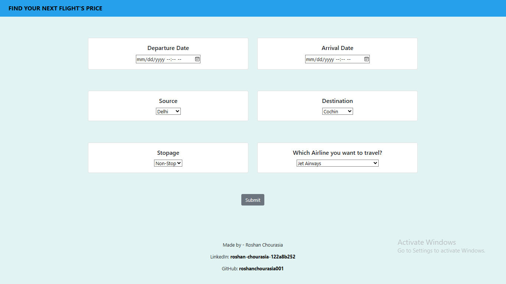
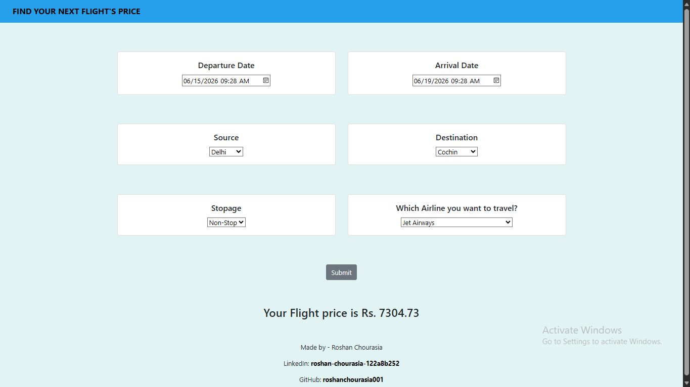

# ✈️ Flight Price Prediction


  
A Machine Learning web application built with **Flask** that predicts flight ticket prices based on various travel parameters.
 
🌐 **Live Demo:** 

<p align="center">
  <a href="http://3.84.125.226:5000">
    
  </a>
</p>

---

## 🏅 Project Merits

| Merit | Detail |
|-------|--------|
| ✅ End-to-End ML Pipeline | From raw data → EDA → Feature Engineering → Model Training → Live Web Deployment |
| 🌐 Full-Stack Integration | ML model seamlessly integrated into a Flask web application with a real UI |
| 📊 Real-World Dataset | Trained on actual historical flight pricing data (10,000+ records) |
| 🌲 High-Accuracy Model | Random Forest Regressor — one of the best algorithms for tabular regression tasks |
| 🧹 Data Preprocessing | Handles missing values, feature extraction from datetime, label encoding, and more |
| 📓 Documented Notebook | Jupyter Notebook with full EDA, visualizations, and model evaluation |
| 🚀 Production-Ready | Includes `Procfile` and `requirements.txt` for seamless cloud deployment |
| 🎯 User-Friendly UI | Clean web interface — no ML knowledge needed to use the app |


---

## 📌 Overview

Flight ticket prices are highly dynamic and hard to predict. This project leverages machine learning to estimate flight fares based on historical data, helping travelers make smarter booking decisions.

---

## 🗂️ Project Structure

```
FlightPrice_Prediction/
│
├── static/css/          # Stylesheets for the web app
├── templates/           # HTML templates (Flask/Jinja2)
├── Flightprice_Predictions.ipynb  # Jupyter Notebook (EDA + Model Training)
├── app.py               # Main Flask application
├── Train.xlsx           # Training dataset
├── Test.xlsx            # Test dataset
├── Procfile             # Deployment configuration
└── requirements.txt     # Python dependencies
```

---

## 🚀 Features

- Predict flight fares based on user inputs
- Clean and interactive web UI
- Trained on real flight data using ML algorithms
- Deployed and hosted live on the web

---

## 💡 Why This Project Stands Out

- **Practical Impact** — Flight prices affect millions of travelers daily; this tool gives users real, data-backed estimates
- **Scalable Architecture** — The Flask app is modular and easy to extend with new features (e.g., more airlines, date ranges)
- **Clean Codebase** — Well-structured with separation of concerns: data, model, and web app are clearly divided
- **Deployable Anywhere** — Works on Render, Heroku, Railway, or any Python-supporting cloud platform out of the box


---

- **Algorithm:** Random Forest Regressor
- **Data:** Historical flight pricing data (Train.xlsx / Test.xlsx)
- **Notebook:** `Flightprice_Predictions.ipynb` covers full EDA, feature engineering, model training, and evaluation

**Key Features Used for Prediction:**
- Airline
- Source & Destination
- Date of Journey
- Departure & Arrival Time
- Number of Stops
- Duration

---

## 🛠️ Tech Stack

| Layer       | Technology          |
|-------------|---------------------|
| Backend     | Python, Flask       |
| ML Library  | Scikit-learn        |
| Frontend    | HTML, CSS           |
| Data        | Pandas, NumPy       |
| Notebook    | Jupyter             |
| Deployment  | Render / Heroku     |


---

## ⚙️ Installation & Setup

1. **Clone the repository**
   ```bash
   git clone https://github.com/roshanchourasia001/FlightPrice_Prediction.git
   cd FlightPrice_Prediction
   ```

2. **Install dependencies**
   ```bash
   pip install -r requirements.txt
   ```

3. **Run the app**
   ```bash
   python app.py
   ```

4. **Open in browser**
   ```
   http://localhost:5000
   ```

---

## 📊 Model Performance


| Metric | Score |
|--------|-------|
| R² Score | 0.80 |
| RMSE  | 2019.46 |
| MAE   |    1289 |

---

## 📸 Screenshots





---

## 🙋‍♂️ Author

**Roshan Chourasia**
- GitHub: [@roshanchourasia001](https://github.com/roshanchourasia001)
- linkedin: [linkedin](https://linkedin.com/roshan-chourasia-122a8b252)

---

## 📄 License

This project is open-source and available under the [MIT License](LICENSE).

---

## ⭐ Support & Stay Connected

If this project helped you or you found it interesting, consider giving it a **star** ⭐ — it takes just a second but means a lot!

> _"A star is a small click for you, but a big motivation for me."_

I'm constantly building more projects like this — from Machine Learning to Full-Stack Web Apps. 


**Follow me on GitHub** to stay updated and never miss what's coming next! 🚀

[](https://github.com/roshanchourasia001)
[](https://github.com/roshanchourasia001/FlightPrice_Prediction)

Let's connect, collaborate, and keep building cool things together! 🤝✨    
